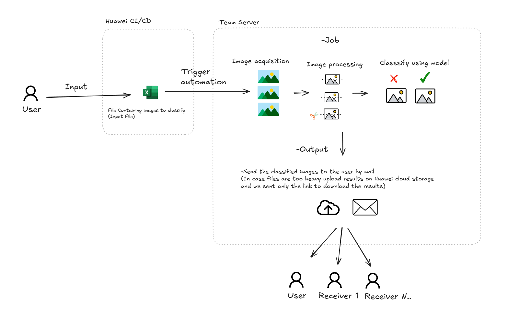

# Watermark Recognition, Binary Classification

This project was developed as part of an initiative at Huawei to streamline the process of detecting watermarks in images. By automating watermark recognition, this solution significantly reduced the need for manual image checks previously performed through Excel, saving time and improving operational efficiency.
 

## Project Overview

The goal of this project was to build a binary classification model capable of identifying watermarked images. This automation replaced labor-intensive manual checks with a machine learning-based solution, enabling faster and more accurate processing.

## Main tools utilized

- Python 3.6 
- Open CV
- Tensorflow

**Used last version of libraries compatible with Python 3.6** 

*Python 3.6 was used due to cybersecurity company policy*

 

- ## Automation functionality

 
 
 
 

# Create model process

## Image acquisition:

 <table align="middle">
  <tr align="middle">
    <td></td>
  </tr>
 </table>

  ## Dataset Generation:

### Problem / Solution: Data augmentation
 <table align="middle">
  <tr align="middle">
    <td></td>
  </tr>
 </table>

## Image processing:

 <table align="middle">
  <tr align="middle">
    <td></td>
  </tr>
    <tr align="middle">
    <td></td>
  </tr>
 </table>

 ## Model:
 ### Train Config:
- *NN train settings could be different to the final deployed version*
 <table align="middle">
  <tr align="middle">
    <td></td>
  </tr>
 </table>

  ### Model Config:
- *NN model settings could be different to the deployed version*
 <table align="middle">
  <tr align="middle">
    <td></td>
  </tr>
 </table>

